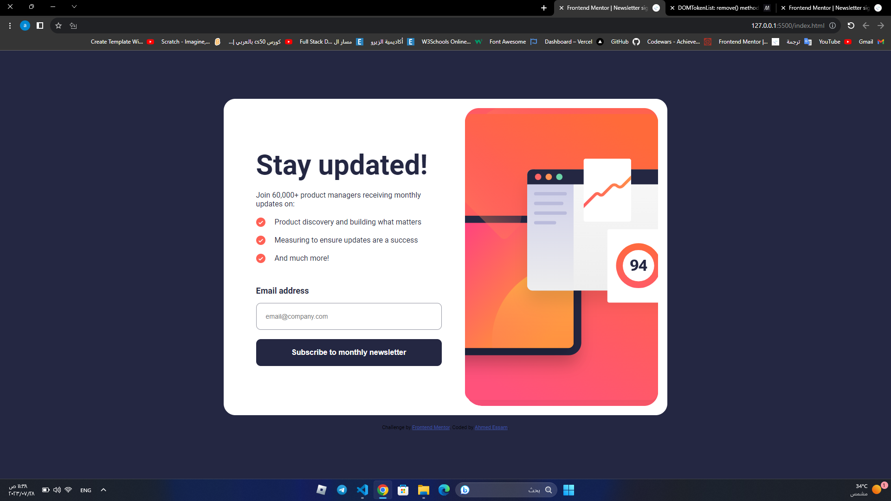
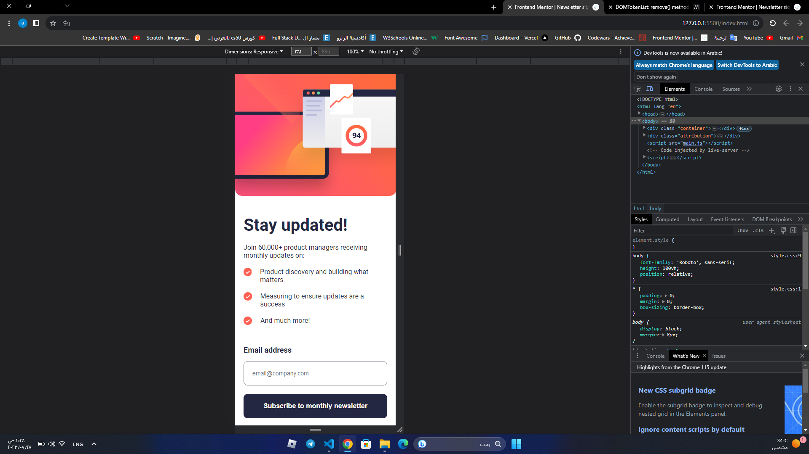

# Frontend Mentor - Newsletter sign-up form with success message solution

This is a solution to the [Newsletter sign-up form with success message challenge on Frontend Mentor](https://www.frontendmentor.io/challenges/newsletter-signup-form-with-success-message-3FC1AZbNrv). Frontend Mentor challenges help you improve your coding skills by building realistic projects. 

## Table of contents

- [Overview](#overview)
  - [Screenshot](#screenshot)
  - [Links](#links)
- [My process](#my-process)
  - [Built with](#built-with)
- [Author](#author)

**Note: Delete this note and update the table of contents based on what sections you keep.**

## Overview
### Screenshot

### Links

- Solution URL: [solution URL](https://github.com/Ah-Essam/sign-up-with-success-message.git)
- Live Site URL: [live site URL](https://sign-up-with-success-message.vercel.app/)

## My process

### Built with

- HTML5 
- CSS 
- Flexbox
- CSS Grid
- J.S

## Author

- Frontend Mentor - [@Ah-Essam](https://www.frontendmentor.io/profile/Ah-Essam)
